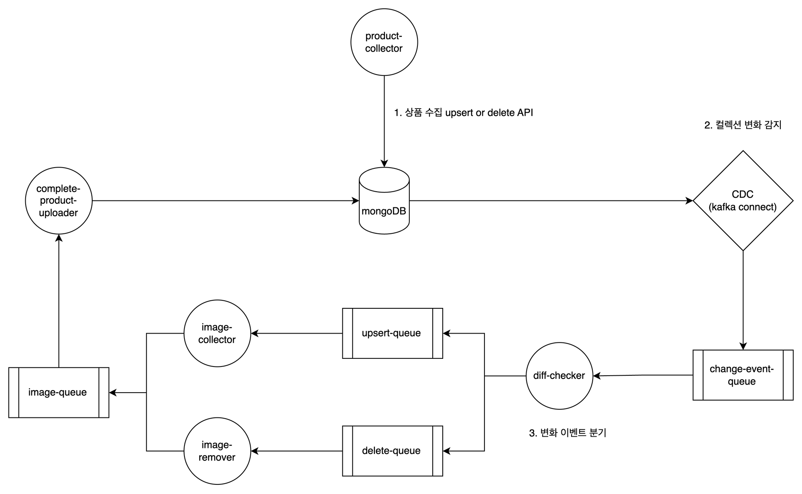

# event-streaming-with-kafka-connect
사이드 프로젝트로 판매 상품을 수집하며 해당 상품의 이미지도 수집해주는 미니멀한 스트리밍 시스템 `MSA`로 구현해보기


## 학습목표
* `코틀린`과 `코루틴`, `웹플럭스`, `reactive mongodb`를 통해 코틀린에서의 비동기, 논블로킹 프로그래밍을 내 것으로 만든다.
* `카프카 커넥트`를 이용하여 `CDC`를 구현해보고 `스트림즈`로 데이터베이스의 변화 이벤트를 받아 가공하여 다른 토픽에 넣어본다.
* `NoSQL`의 장점을 체감해본다.


## 기술 스택
* `spring boot 3.x`, `kotlin`
* `webflux`, `coroutine`
* `kafka connect`, `kafka streams`
* `kubernetes`
* `mongodb`

## 기능적 요구사항
* [X] 상품을 `수집`할 수 있다. 
  * [X] `mallId` 내 상품 식별값은 중복되어서는 안된다.
``` json
"POST /api/v1/products"
{
  "mallId": "String", // 입점가게 고유 식별값
  "productId": "String", // 해당 상품 고유 식별값
  "title": "String", // 상품 명
  "content": "String", // 상품 소개
  "price": "String", // 상품 가격
  "imageUrl": "String" // 메인 이미지 URL
}
```
* [X] 상품 수집 시 `image url`을 받으면 해당 이미지를 수집한다.
* [X] `productId`가 동일하면 상품을 `업데이트`한다. 상품이 업데이트되면 이미지를 재수집한다.
* [X] 상품을 `전체 조회`할 수 있다. 조회 시 실제 수집한 이미지의 경로도 반환한다. 
  * [X] 수집되지 않은 상품은 조회되지 않는다.
```json
"GET /api/v1/complete-products"
```
* [X] 상품을 `상세조회` 할 수 있다.
```json
"GET /api/v1/complete-products/{productId}"
```
* [X] 상품을 `삭제`할 수 있다.
  * [X] 상품이 삭제되면 S3에서 해당 상품의 이미지도 삭제한다.
```json
"DELETE /api/v1/complete-products/{productId}"
```

## 비기능적 요구사항
* [X] `코틀린`으로 구현한다. 
  * 코틀린으로 처리 가능한 부분은 `reactive streams` 대신 `kotlin coroutine`으로 변환하여 작업한다.
* [X] `MSA`를 고려하며 `multi module` 로 구성하기!
* [X] `마이크로서비스 아키텍처`로 설계, 개발한다.
* [X] `웹플럭스`를 이용해 비동기, 논블로킹하게 전반적인 시스템을 스트림 형태로 구현한다.
* [X] `Mongo`, `Kafka`는 `on-promise`에 구축한다.
* [X] `producer`, `consumer`는 `k3s`에 구축한다.
* [ ] `nGrinder`나 다른 도구를 이용해 성능측정 해보기, 그 과정에서 Auto Scaling 확인한다.

## Architecture


## 시작하기
* `java 17`을 설치한다.
* `docker desktop`을 설치하고 `enable kubernetes`를 체크하여 쿠버네티스를 활성화한다.

### 1. infra 구성
`infra` 환경 구성을 한다.
```bash
cd ./infrastructure

cat README.md
```

### 2. product-collector endpoint 확인
`product-collector` 는 쿠버네티스에서 서비스 타입 `NodePort`로 외부에 노출하고 있습니다.

즉 쿠버네티스 노드의 아이피와 포트를 확인합니다.

#### port 확인
```bash
kubectl get svc
```

#### API Call
```agsl
POST http://localhost:{port}/api/..
```